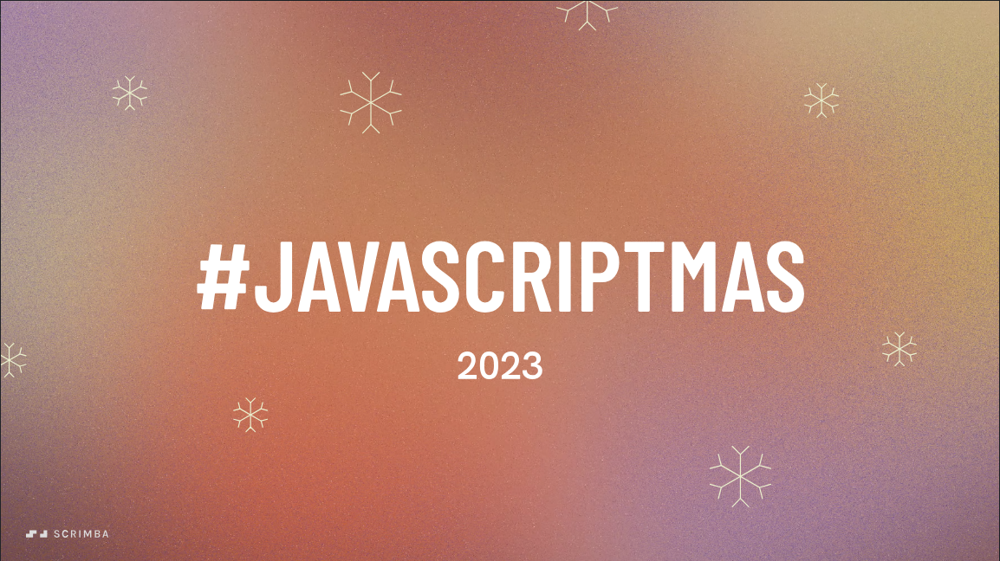

# JavaScriptmas 🎄

> Criei esse repositório para registrar minha participação nos desafios organizado pela Scrimba

## O que é o JavaScriptmas?

> JavaScriptmas é um desafio diário de codificação de 24 dias em JavaScript (com um pouco de HTML e CSS), organizado pela escola norueguesa de codificação online, Scrimba , de 1º a 24 de dezembro.

## Dia 01 - Contagem regressiva para o Natal

- Desafio:
  - Obtenha a data de hoje (você só precisa do dia)
  - Calcular os dias restantes
  - Exibir dias restantes
- Metas estendidas:
  - exibir horas, minutos, segundos
  - adicione uma contagem regressiva para outro festival, seu aniversário ou Natal de 2024.

## Dia 02 - Estilize um botão colorido

- Desafio:
  - Bordas gradientes
  - Adicionar uma borda de 115 graus com as cores fornecidas ou cores próprias
  - Usei a paleta de cores do natal

## Dia 03 - Dividir os doces

- Desafio:
  - Algumas crianças ganharam alguns doces.
  - Eles querem comer o máximo de doces que puderem, mas cada criança deve comer exatamente a mesma quantidade.
  - Determine quantos pedaços de doce podem ser consumidos no total.
  - Um pedaço de doce não pode ser dividido.
- Exemplo:
  - Crianças: 3, Doces: 10
  - Cada uma das 3 crianças pode comer 3 doces.
  - Portanto, o número total de doces que podem ser consumidos é 3*3 = 9, então a função calcTotalCandies deve desconectar 9.

## Dia 04 - Gerador de piadas de Natal com IA

- Desafio:
  - Use IA para gerar uma piada de Natal de uma linha.
- Metas estendidas:
  - Use um provedor de IA diferente. 

## Dia 05 - Virar cartão de Natal

- Desafio:
  - O cartão tem dois lados e vira de frente para trás ao passar o mouse.
  - Combine os estilos o mais próximo possível.
- Metas estendidas:
  - Adicionei um background-image e escolhi uma imagem com tema natalino
  - Efeito 3D

## 🛠 Tecnologias
> Tecnologias usadas para desenvolver os desafios

- HTML
- CSS
- Javascript

## 🖤 Contato

jhessfsantos@gmail.com